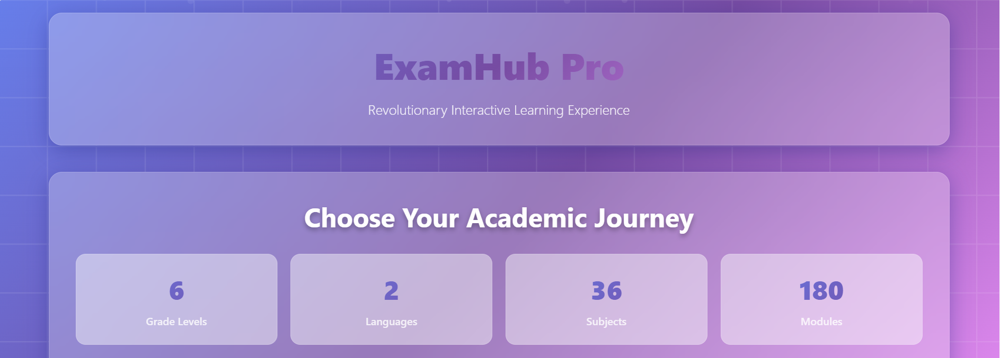
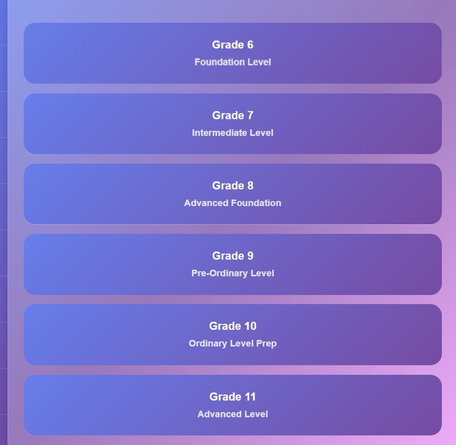
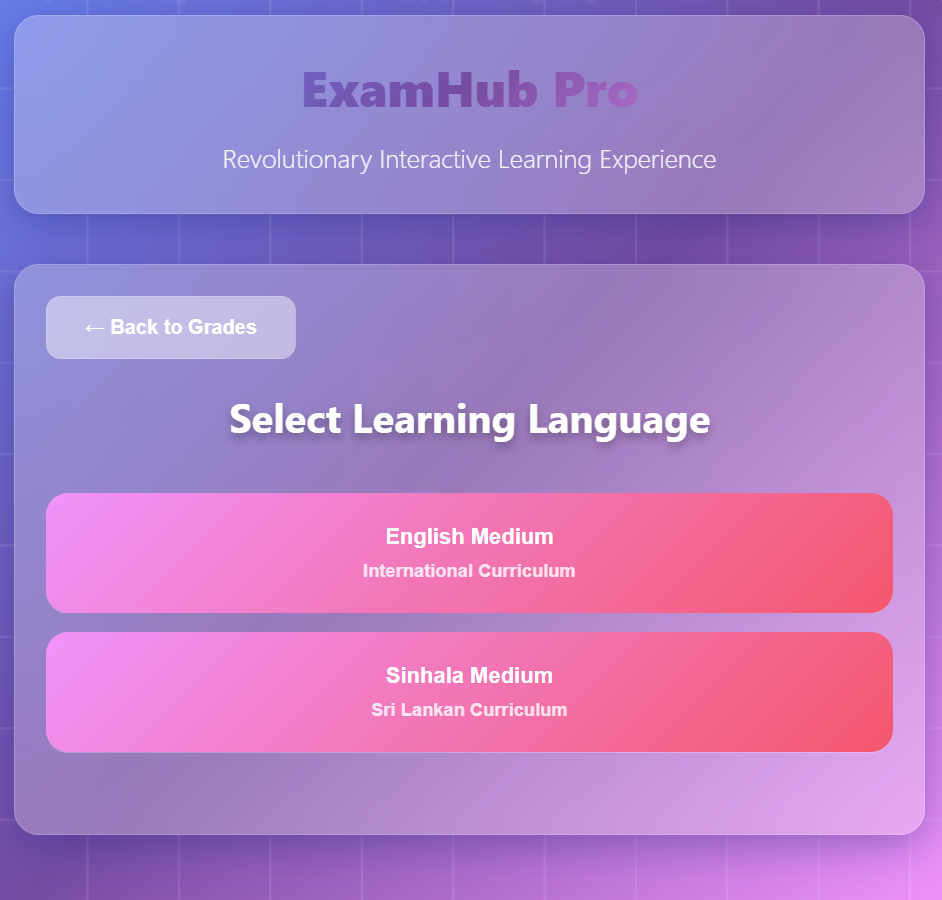
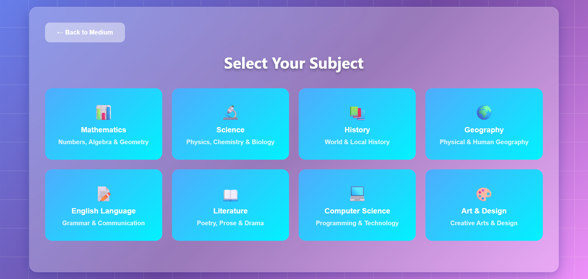
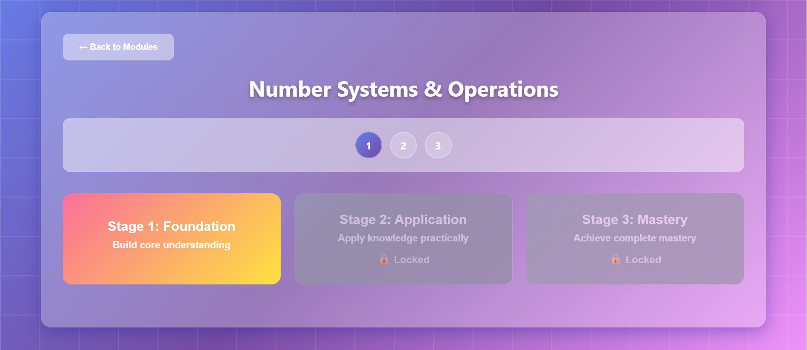

# 📘 ExamHub – Interactive Exam Preparation Platform  

ExamHub is a web-based interactive learning platform designed for students of **Grades 6 to 11**. It allows students to choose their grade, medium of instruction (Sinhala/English), subjects, and dive into **modules & stages** that progressively unlock learning content. Students earn a **completion certificate** after finishing each module.

---

## 🚀 Project Objective  
The goal of ExamHub is to **empower students through interactive learning** by providing structured, stage-based quizzes and activities that make exam preparation engaging and rewarding.  

---

## ✨ Key Features  

- 🏠 **Homepage & Logo** – Clean UI with an empowering tagline.  
- 🎓 **Grade Selection** – Choose Grade 6–11.  
- 🌐 **Medium Selection** – Sinhala or English (dynamic content).  
- 📚 **Subject Selection** – Mathematics, Science, History, Geography, English, Literature.  
- 🧩 **Modules** – Each subject has multiple modules (e.g., History: Ancient → Post-Independence).  
- 📖 **Stages** – 3 difficulty levels per module (Basic → Advanced).  
- 🏅 **Certificate Generation** – Digital certificate after completing all stages in a module.  
- 📊 **User Progression** – Progress bar, stage unlocking, and ability to revisit modules.  

---

## 🖼️ Screenshots / Demo  

> Replace these placeholders with actual images of your project.  

### 🔹 Homepage  
  

### 🔹 Grade  
  

### 🔹 Medium
  

### 🔹 Subject Selection  
  
  
### 🔹 Stages  
  

### 🔹 Certificates
  

---

## 🧭 User Flow  

1️⃣ Homepage → Select Grade  
2️⃣ Choose Medium (Sinhala/English)  
3️⃣ Select Subject (Math, Science, History, etc.)  
4️⃣ Select Module (e.g., History → Ancient Civilizations)  
5️⃣ Progress through **Stage 1 → Stage 2 → Stage 3**  
6️⃣ Earn **Completion Certificate** 🎓  

---

## 🛠️ Technology Stack  

- **Frontend:** HTML, CSS, JavaScript  
- **UI/UX:** Clean, simple, responsive design  
- **Interactivity:** JavaScript for stage unlocking, quizzes, and certificate generation  

---

## 📌 Future Enhancements  

- 🔑 User login system with personalized dashboards  
- 💾 Database integration for saving progress  
- 📱 Mobile-friendly version  
- 🌍 Multi-language support beyond Sinhala & English  

---

